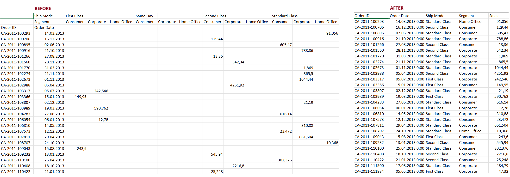

# 🚀 Ship Mode Sales Normalization

## 📌 Project Goal

Normalize a cross-tabulated sales table where values are distributed across combinations of `Ship Mode` and `Segment`, transforming it into a format suitable for analysis and visualization.

## 🛠 Tools Used

- Power Query (Excel / Power BI)
- Excel for initial inspection
- Step-by-step transformation documentation

## 📊 Final Output

| Order ID       | Order Date   | Ship Mode      | Segment      | Sales   |
|----------------|--------------|----------------|--------------|---------|
| CA-2011-100293 | 14.03.2013   | Standard Class | Home Office  | 91,056  |

## 📚 Beginner-Friendly Concepts

- Cleaning and reshaping messy data
- Transposing, unpivoting, and merging columns
- Extracting attributes from header labels
- Preparing data for BI tools

## 📄 Documentation

- [Step-by-step Power Query guide](powerquery/transformation_steps.md)
- [Case description](docs/case_description.md)

## 🧠 Resume Highlight

> "Normalized a cross-tabulated sales table using Power Query. Applied transposition, cleaning, column merging, and unpivoting. Prepared data for analysis and visualization. Documented the process for beginner analysts."

## 📷 Screenshots

## 📥 How to Use

1. Open `raw_dirty_sales_table.xlsx` in Excel  
2. Launch Power Query  
3. Follow the [transformation guide](powerquery/transformation_steps.md)  
4. Export the normalized table
